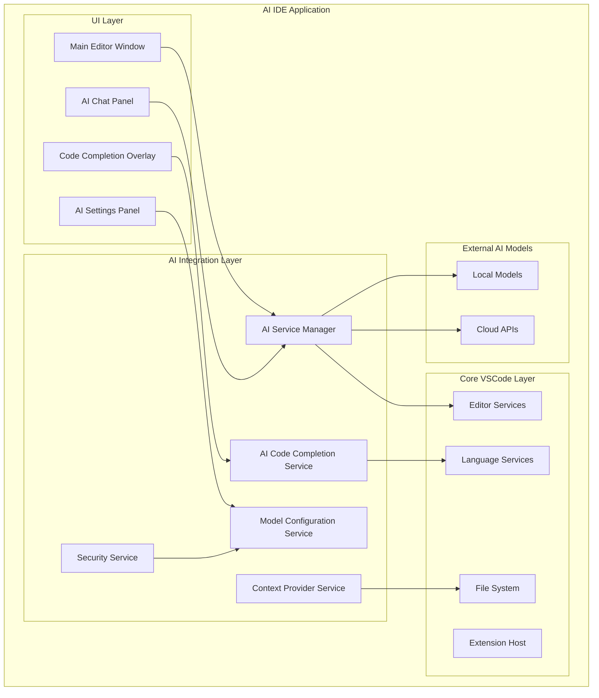

# Design Document

## Overview

The AI IDE will be built by extending the existing VSCode codebase with AI capabilities while maintaining full compatibility with VSCode extensions and functionality. The architecture follows a modular approach where AI features are integrated as additional services and UI components without disrupting the core editor functionality.

The system consists of three main layers:
1. **Core VSCode Layer**: The existing VSCode functionality (editor, file system, extensions, etc.)
2. **AI Integration Layer**: New services and APIs for AI model communication and management
3. **AI UI Layer**: Chat panels, code completion overlays, and AI-specific user interfaces

## Architecture

### High-Level Architecture



### Component Architecture

#### AI Service Manager
- **Purpose**: Central orchestrator for all AI operations
- **Responsibilities**:
  - Route requests to appropriate AI models
  - Manage model lifecycle and connections
  - Handle fallback scenarios
  - Coordinate between different AI services
- **Location**: `src/vs/workbench/services/ai/common/aiService.ts`

#### Model Configuration Service
- **Purpose**: Manage AI model settings and credentials
- **Responsibilities**:
  - Store and retrieve model configurations
  - Encrypt/decrypt API keys and sensitive data
  - Validate model endpoints and settings
  - Provide model switching capabilities
- **Location**: `src/vs/workbench/services/ai/common/modelConfigurationService.ts`

#### Context Provider Service
- **Purpose**: Gather and format context for AI requests
- **Responsibilities**:
  - Extract relevant code context from active files
  - Provide workspace and project information
  - Format context for different AI model requirements
  - Manage context size limits
- **Location**: `src/vs/workbench/services/ai/common/contextProviderService.ts`

#### AI Code Completion Service
- **Purpose**: Handle AI-powered code suggestions
- **Responsibilities**:
  - Integrate with VSCode's completion provider system
  - Generate code completions using AI models
  - Cache and optimize completion requests
  - Provide inline code suggestions
- **Location**: `src/vs/workbench/services/ai/common/aiCodeCompletionService.ts`

## Components and Interfaces

### Core AI Interfaces

```typescript
// AI Service Interface
interface IAIService {
    sendChatMessage(message: string, context?: ICodeContext): Promise<string>;
    getCodeCompletion(position: Position, context: string): Promise<ICompletionItem[]>;
    refactorCode(code: string, instruction: string): Promise<string>;
    switchModel(modelId: string): Promise<void>;
}

// Model Configuration Interface
interface IModelConfiguration {
    id: string;
    name: string;
    type: 'local' | 'cloud';
    endpoint: string;
    apiKey?: string;
    parameters: Record<string, any>;
    isDefault: boolean;
}

// Code Context Interface
interface ICodeContext {
    activeFile?: string;
    selectedText?: string;
    cursorPosition?: Position;
    openFiles?: string[];
    workspaceInfo?: IWorkspaceInfo;
}
```

### UI Component Integration

#### AI Chat Panel
- **Integration Point**: VSCode's panel system (`src/vs/workbench/browser/parts/panel/`)
- **Features**:
  - Conversational interface with AI models
  - Code context awareness
  - Message history and persistence
  - Model switching controls

#### Code Completion Integration
- **Integration Point**: VSCode's completion provider system
- **Features**:
  - Inline AI-powered suggestions
  - Multi-line code generation
  - Context-aware completions
  - Fallback to standard VSCode completions

#### Settings Integration
- **Integration Point**: VSCode's settings system
- **Features**:
  - Model configuration UI
  - API key management
  - AI behavior customization
  - Security settings

## Data Models

### AI Configuration Schema
```json
{
  "ai": {
    "models": [
      {
        "id": "local-llama",
        "name": "Local Llama 3.1",
        "type": "local",
        "endpoint": "http://localhost:11434/api/generate",
        "parameters": {
          "temperature": 0.7,
          "max_tokens": 2048
        },
        "isDefault": true
      },
      {
        "id": "openai-gpt4",
        "name": "OpenAI GPT-4",
        "type": "cloud",
        "endpoint": "https://api.openai.com/v1/chat/completions",
        "apiKey": "encrypted_key_here",
        "parameters": {
          "temperature": 0.3,
          "max_tokens": 4096
        }
      }
    ],
    "features": {
      "codeCompletion": true,
      "chatAssistant": true,
      "codeRefactoring": true
    },
    "security": {
      "encryptCredentials": true,
      "allowLocalModels": true,
      "contextSizeLimit": 8192
    }
  }
}
```

### Message History Schema
```json
{
  "conversations": [
    {
      "id": "uuid",
      "timestamp": "2025-01-23T10:00:00Z",
      "modelId": "local-llama",
      "messages": [
        {
          "role": "user",
          "content": "How do I implement a binary search?",
          "context": {
            "activeFile": "src/algorithms.ts",
            "selectedText": "function search(arr, target) {"
          }
        },
        {
          "role": "assistant",
          "content": "Here's a binary search implementation..."
        }
      ]
    }
  ]
}
```

## Error Handling

### AI Service Error Handling
- **Connection Failures**: Graceful fallback to alternative models or offline mode
- **API Rate Limits**: Implement request queuing and retry mechanisms
- **Invalid Responses**: Validate AI responses and provide fallback suggestions
- **Authentication Errors**: Clear error messages and credential re-entry prompts

### Security Error Handling
- **Credential Encryption Failures**: Secure fallback to in-memory storage
- **API Key Validation**: Real-time validation with clear error feedback
- **Context Leakage Prevention**: Sanitize sensitive information from AI requests

### User Experience Error Handling
- **Model Unavailability**: Show clear status indicators and alternative options
- **Slow Response Times**: Progress indicators and cancellation options
- **Completion Failures**: Seamless fallback to standard VSCode completions

## Testing Strategy

### Unit Testing
- **AI Service Layer**: Mock AI model responses and test service logic
- **Configuration Management**: Test encryption, validation, and storage
- **Context Providers**: Test context extraction and formatting
- **UI Components**: Test React components and user interactions

### Integration Testing
- **Model Communication**: Test actual API calls with test models
- **VSCode Integration**: Test extension compatibility and core functionality
- **End-to-End Workflows**: Test complete user scenarios from UI to AI response

### Performance Testing
- **Response Times**: Measure AI request/response latency
- **Memory Usage**: Monitor memory consumption with AI features active
- **Completion Performance**: Test code completion speed and accuracy
- **Concurrent Requests**: Test multiple simultaneous AI operations

### Security Testing
- **Credential Storage**: Verify encryption and secure storage
- **API Key Handling**: Test key validation and secure transmission
- **Context Sanitization**: Verify sensitive data is not sent to AI models
- **Local Model Security**: Test local model isolation and security

### Compatibility Testing
- **Extension Compatibility**: Test with popular VSCode extensions
- **Platform Testing**: Verify functionality on Windows, macOS, and Linux
- **Model Compatibility**: Test with different AI model types and versions
- **Upgrade Testing**: Test migration from standard VSCode to AI IDE

## Build and Packaging Strategy

### Development Build Process
1. **Standard VSCode Build**: Use existing gulp-based build system
2. **AI Feature Integration**: Compile AI services and UI components
3. **Asset Bundling**: Include AI-specific assets and configurations
4. **Extension Compatibility**: Ensure extension API compatibility

### Production Packaging
1. **Electron Packaging**: Use existing electron packaging with AI features
2. **Code Signing**: Sign the executable for distribution
3. **Installer Creation**: Create Windows installer with AI IDE branding
4. **Update Mechanism**: Implement secure update system for AI features

### Distribution Strategy
- **Standalone Executable**: Single .exe file with all dependencies
- **Portable Version**: No-install version for easy deployment
- **Auto-Update System**: Secure update mechanism for AI features
- **Extension Marketplace**: Custom marketplace for AI-specific extensions
